<h3><code>hlxecz@github ~ $ ./contributions.sh</code></h3>

  

<h3><code>hlxecz@github ~ $ whoami</code></h3>

<table>
  <tr>
    <td valign="top"></td>
    <td valign="top"></td>
  </tr>
</table>

  

<h3><code>hlxecz@github ~ $ ./snake.sh</code></h3>

<picture>
  <source media="(prefers-color-scheme: dark)" srcset="https://raw.githubusercontent.com/Hlxecz/Hlxecz/output/github-contribution-grid-snake-dark.svg" />
  
</picture>

  

<h3><code>hlxecz@github ~ $ ./links.sh</code></h3>

<!-- Inspired by https://www.avivashishta.com/blog/build-animated-github-profile-readme -->
